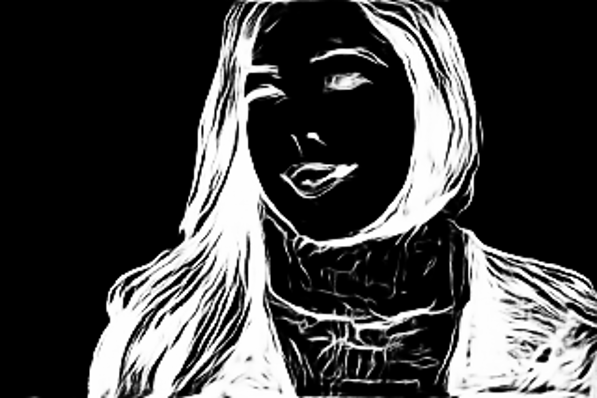

# U-2-Net GGML

U-2-Net inference implementation using GGML.

| Input Image | Output Image |
| :---: | :---: |
|  |  |

## Features

- Multi-threaded CPU inference
- CUDA GPU acceleration (optional)
- GGML backend abstraction
- Performance timing

## Build

### 1. Clone GGML

```bash
git clone --depth 1 https://github.com/ggerganov/ggml.git
```

### 2. Build

```bash
mkdir build && cd build
cmake ..
make
```

### With CUDA GPU Support

Requires CUDA Toolkit 12.x installed. Clone GGML first, then:

```bash
mkdir build && cd build
cmake -DU2NET_CUDA=ON ..
make
```

## Usage

```bash
./u2net-cli [options] <model.gguf> <input.jpg> [output.png]
```

**Arguments:**
- `model.gguf`: U-2-Net model in GGUF format
- `input.jpg`: Input image
- `output.png`: Output mask (default: output.png)

**Options:**
- `-t N`: Number of CPU threads (default: CPU cores)
- `-d D`: Device: cpu, cuda, auto (default: auto)
- `-h`: Show help

## Performance

| Device | Time (320x320) |
|--------|----------------|
| CPU 1 thread | ~6.5s |
| CPU 12 threads | ~2.0s |
| CUDA GPU | ~0.1-0.3s (estimated) |

## Model Conversion

Use `convert.py` to convert PyTorch model to GGUF format:

```bash
python convert.py
```

## Requirements

- CMake 3.14+
- C++17 compiler
- GGML (see Build step 1)
- CUDA Toolkit 12.x (optional, for GPU support)
