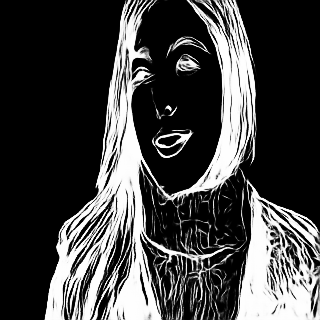

# U-2-Net GGML

U-2-Net inference implementation using GGML.

| Input Image | Output Image |
| :---: | :---: |
|  |  |

## Build

```bash
mkdir build && cd build
cmake ..
make
```

## Usage

```bash
./u2net-cli <model.gguf> <input.jpg> [output.png]
```

- `model.gguf`: U-2-Net model in GGUF format
- `input.jpg`: Input image
- `output.png`: Output mask (default: output.png)

## Model Conversion

Use `convert.py` to convert PyTorch model to GGUF format:

```bash
python convert.py
```

## Requirements

- CMake 3.14+
- C++17 compiler
- GGML (included as submodule)
